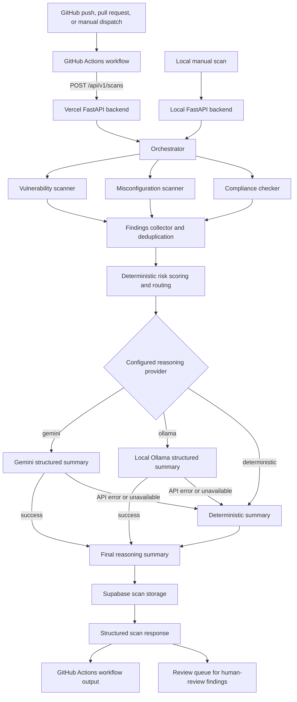
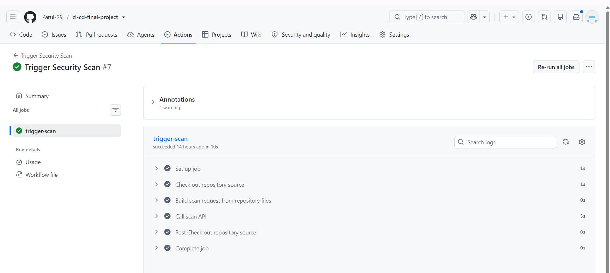
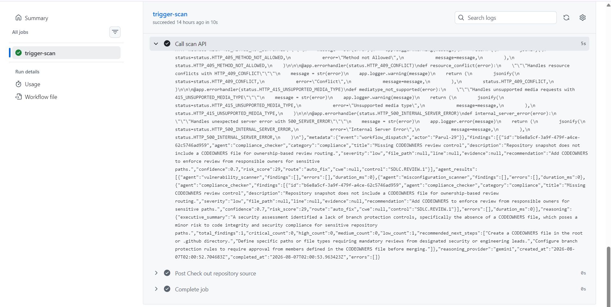
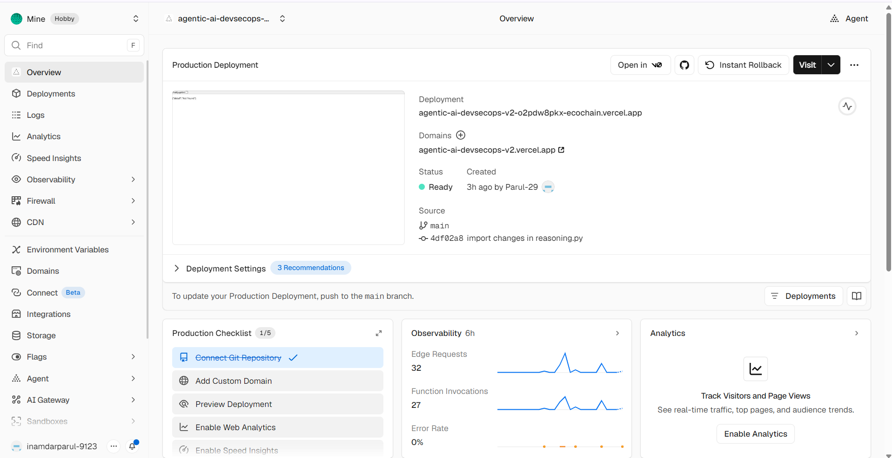
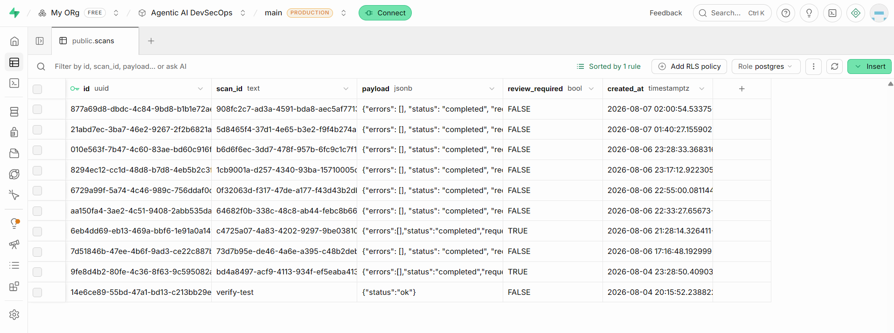
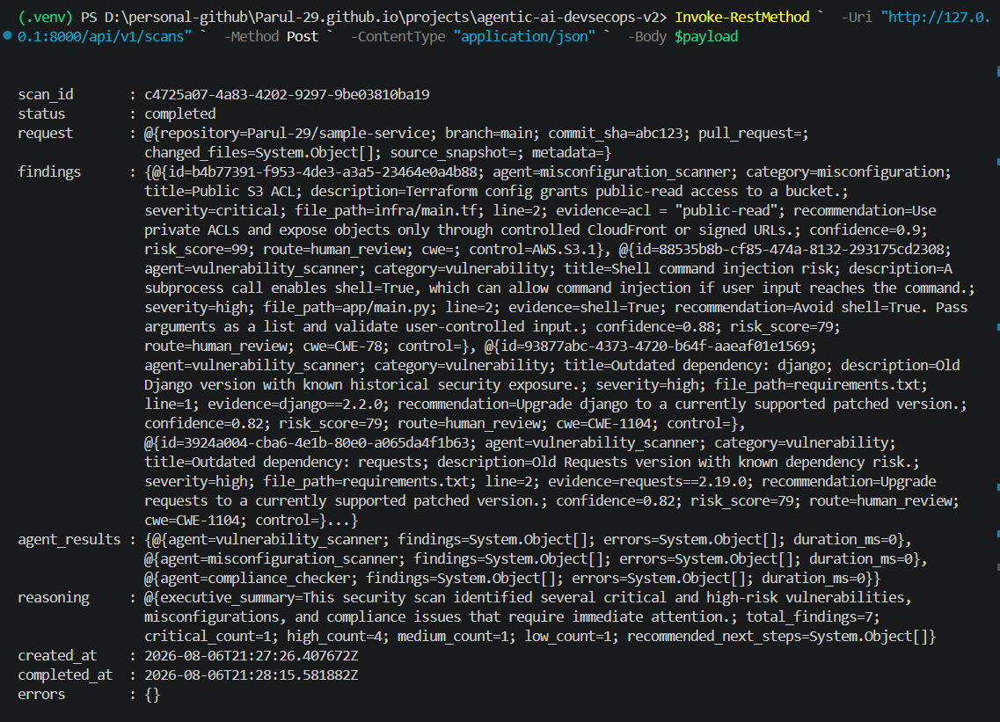

# Agentic AI DevSecOps Pipeline Automation

An automated DevSecOps backend that scans repository content for security and
compliance issues, uses an LLM to create a structured security summary, and
persists scan history in Supabase.

## Project overview

This project combines deterministic security rules with optional LLM reasoning.
The rule-based agents identify potential vulnerabilities, infrastructure
misconfigurations, and compliance gaps. Gemini or Ollama then summarizes the
findings in a structured format; if an LLM is unavailable, deterministic
reasoning keeps the scan usable.

## Objectives

- Automate early security and compliance checks in the CI/CD workflow.
- Detect common code, dependency, infrastructure, and workflow risks from a
  repository snapshot.
- Turn raw findings into prioritized, actionable recommendations.
- Support both deployed Gemini reasoning and local Ollama experimentation.
- Persist scan evidence and human-review status for later analysis.

## Key benefits

| Benefit | Value delivered |
| --- | --- |
| Earlier feedback | Developers receive security findings during the GitHub Actions workflow. |
| Multi-layer coverage | Independent agents assess vulnerabilities, misconfigurations, and compliance controls. |
| Resilient reasoning | Deterministic fallback keeps scans useful when Gemini or Ollama is unavailable. |
| Traceability | Supabase retains scan results, findings, timestamps, and review status. |
| Flexible development | Gemini supports the deployed backend while Ollama supports local experimentation. |

## System architecture



The current GitHub Actions workflow calls `POST /api/v1/scans` directly.
Webhook routes exist for future use, but webhooks are not the current trigger.

## Core capabilities

| Capability | Current implementation |
| --- | --- |
| Automated trigger | GitHub Actions on push, pull request, or manual dispatch |
| API backend | FastAPI deployed as a Vercel Python function |
| Security agents | Vulnerability, misconfiguration, and compliance scanners |
| AI reasoning | Gemini in the deployed backend; Ollama available locally |
| Fallback | Deterministic summary, risk scoring, and routing |
| Persistence | Supabase stores scan payloads, findings, and review status |
| Quality check | Unit tests cover GitHub Actions permissions and Tekton false-positive handling |

## Repository structure

```text
api/
  index.py                  Vercel serverless entry point
app/
  agents/
    vulnerability.py        Python and dependency rule checks
    misconfiguration.py     Terraform, IAM, and workflow checks
    compliance.py           CI/CD and review-control checks
    reasoning.py            Gemini, Ollama, and deterministic reasoning
  config.py                 Environment-based settings
  main.py                   FastAPI routes
  models.py                 Pydantic request and response schemas
  orchestrator.py           Parallel agent coordinator
  storage.py                Supabase and in-memory storage routing
examples/
  sample_scan.json          Example API request
tests/
  test_compliance.py        Focused compliance rule tests
vercel.json                 Vercel routing configuration
```

## Run locally

Create and activate a virtual environment, then install the dependencies:

```powershell
python -m venv .venv
.venv\Scripts\activate
python -m pip install -r requirements.txt
```

Create a local `.env` file with the environment variables shown below, then
start the API:

```powershell
python -m uvicorn app.main:app --reload
```

Open the interactive API documentation at:

```text
http://127.0.0.1:8000/docs
```

Run the focused unit tests:

```powershell
python -m unittest discover -s tests -v
```

## Configure reasoning and storage

### Deployed backend: Gemini with Supabase

Set these values in Vercel **Settings → Environment Variables**:

```env
STORAGE_BACKEND=supabase
SUPABASE_URL=https://your-project-ref.supabase.co
SUPABASE_SERVICE_ROLE_KEY=your-service-role-key
LLM_PROVIDER=gemini
GEMINI_API_KEY=your-gemini-api-key
GEMINI_MODEL=gemini-3.1-flash-lite
```

Create the Supabase table once in the Supabase SQL Editor:

```sql
create table if not exists scans (
  id uuid primary key default gen_random_uuid(),
  scan_id text unique not null,
  payload jsonb not null,
  review_required boolean default false,
  created_at timestamptz default now()
);

create index if not exists scans_review_required_idx on scans(review_required);
create index if not exists scans_created_at_idx on scans(created_at desc);
```

Keep the Supabase service-role key and Gemini API key in Vercel only; never
commit them to Git.

### Local backend: Ollama with Supabase

Ensure Ollama is running locally, then set:

```env
STORAGE_BACKEND=supabase
SUPABASE_URL=https://your-project-ref.supabase.co
SUPABASE_SERVICE_ROLE_KEY=your-service-role-key
LLM_PROVIDER=ollama
OLLAMA_BASE_URL=http://localhost:11434
OLLAMA_MODEL=llama3.1
```

### Deterministic fallback

Set `LLM_PROVIDER=deterministic` to use only rule-based scoring, or allow an
LLM request to fail: the application returns the deterministic summary and sets
`reasoning_provider` to `deterministic`.

## Deploy to Vercel

1. Push this project to GitHub, or import the parent repository and set
   `projects/agentic-ai-devsecops-v2` as the Vercel **Root Directory**.
2. Add the Gemini and Supabase environment variables shown above.
3. Deploy; Vercel uses `api/index.py` as the FastAPI entry point.
4. Verify the deployment:

   ```text
   https://your-vercel-domain.vercel.app/health
   ```

   Expected response:

   ```json
   {"status":"ok"}
   ```

## API endpoints

| Method | Endpoint | Purpose |
| --- | --- | --- |
| `GET` | `/health` | Service health check |
| `POST` | `/api/v1/scans` | Run a scan from a structured repository snapshot |
| `GET` | `/api/v1/scans/{scan_id}` | Retrieve a stored scan |
| `GET` | `/api/v1/review-queue` | List scans that require human review |
| `POST` | `/api/v1/github/webhook` | Reserved route for future webhook-driven scans |

## Example scan request

Use [examples/sample_scan.json](examples/sample_scan.json) as a ready-to-run
payload, or send a request from the FastAPI docs page.

```json
{
  "repository": "Parul-29/sample-service",
  "branch": "main",
  "commit_sha": "abc123",
  "changed_files": [
    "app/main.py",
    "requirements.txt",
    "infra/main.tf",
    ".github/workflows/ci.yml"
  ],
  "source_snapshot": {
    "app/main.py": "import subprocess\nsubprocess.call(user_input, shell=True)\n",
    "requirements.txt": "django==2.2.0\nrequests==2.19.0\n",
    "infra/main.tf": "resource \"aws_s3_bucket\" \"logs\" { acl = \"public-read\" }\n"
  }
}
```

## Results

Each completed scan returns a structured response containing findings, a
reasoning summary, the selected reasoning provider, and timestamps. This makes
the result easy to demonstrate in GitHub Actions, the FastAPI docs, and the
Supabase `scans` table.

| Result field | Meaning |
| --- | --- |
| `findings` | Security and compliance findings produced by scanner agents |
| `reasoning` | Structured executive summary and recommended next steps |
| `reasoning_provider` | `gemini`, `ollama`, or `deterministic` |
| `review_required` | Supabase field indicating whether a scan has a human-review finding |
| `agent_results` | Per-agent findings, errors, and duration |

Example of a successful Gemini-backed result:

```json
{
  "status": "completed",
  "reasoning_provider": "gemini",
  "reasoning": {
    "executive_summary": "A security assessment identified a review-control gap.",
    "total_findings": 1,
    "recommended_next_steps": [
      "Create a CODEOWNERS file for sensitive paths."
    ]
  }
}
```

### Image 1: GitHub Actions automated scan

The GitHub Actions workflow completes successfully and calls the deployed scan
API.



The returned response confirms Gemini was used for the reasoning summary.



### Image 2: Vercel production deployment

The FastAPI backend is deployed and ready on Vercel.



### Image 3: Supabase persistent scan storage

Supabase stores completed scans, their payloads, timestamps, and the
`review_required` status.



### Image 4: Local Ollama scan

The same backend can be run locally with Ollama reasoning.



## Challenges faced and solutions

| Challenge | Solution |
| --- | --- |
| LLM output can be inconsistent | Pydantic models enforce a structured response; deterministic reasoning provides a fallback. |
| Agents can fail or exceed time limits | The orchestrator runs agents independently with retries, timeouts, and graceful degradation. |
| False positives reduce trust | Findings are deduplicated, risk-scored, and path-aware compliance checks avoid treating Tekton YAML as GitHub Actions. |
| Security feedback arrives too late | GitHub Actions triggers scans automatically as part of the development workflow. |
| Results disappear after a serverless request | Supabase persists scan payloads and outcomes for later retrieval. |
| Local and cloud LLM availability differ | Gemini is used on Vercel, Ollama is supported locally, and deterministic reasoning works everywhere. |

## Outcomes

| Outcome | Result |
| --- | --- |
| Automated scanning | Repository changes can trigger a scan through GitHub Actions. |
| Multi-agent coverage | Vulnerability, misconfiguration, and compliance checks run in parallel. |
| AI-assisted prioritization | Gemini creates structured security summaries and next steps. |
| Resilient execution | Deterministic fallback keeps results available when an LLM is unavailable. |
| Persistent evidence | Supabase retains scan results and review status. |
| False-positive control | The compliance rule distinguishes GitHub Actions workflows from Tekton YAML. |

## Technology stack

| Category | Tools and technologies |
| --- | --- |
| Backend API | Python, FastAPI, Uvicorn, Pydantic |
| Deployment | Vercel Python serverless functions |
| Automation | GitHub Actions |
| Scanner orchestration | `asyncio`, custom rule-based agents, retry and timeout handling |
| AI reasoning | Google Gemini API, Ollama, deterministic fallback |
| Data persistence | Supabase PostgreSQL and REST API |
| Testing | Python `unittest` |
| Configuration | Environment variables, `python-dotenv` |

## Future roadmap

See [NEXT_VERSION.md](NEXT_VERSION.md) for planned work including richer rules,
pull-request annotations, finding lifecycle management, reliable background
processing, monitoring, and dashboard reporting.

## Architecture decision records

- [ADR 0001: Deploy FastAPI on Vercel and persist scans in Supabase](docs/adr/0001-vercel-and-supabase.md)
- [ADR 0002: Use Gemini, Ollama, and deterministic fallback for reasoning](docs/adr/0002-hybrid-llm-reasoning.md)
